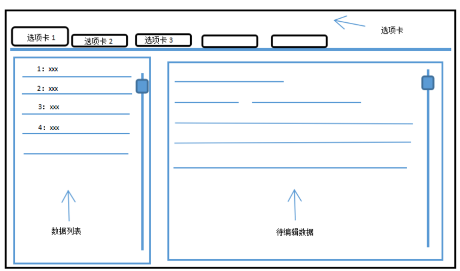
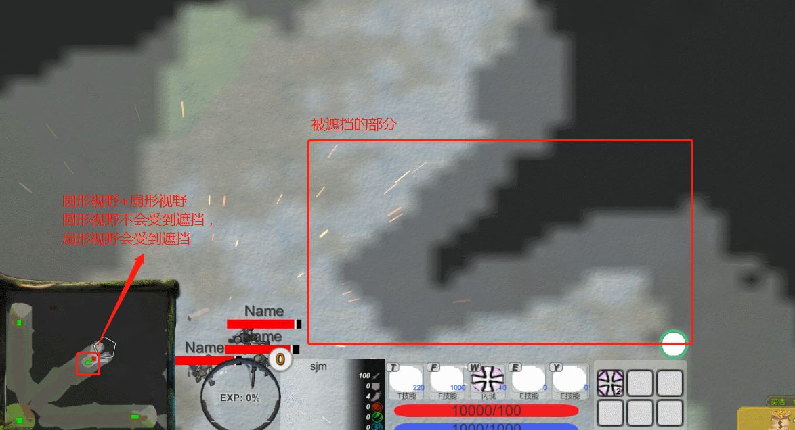

<!-- TOC -->

- [1. 游戏整体逻辑](#1-游戏整体逻辑)
    - [1.1. 出兵逻辑](#11-出兵逻辑)
        - [1.1.1. 需要注意的点](#111-需要注意的点)
        - [1.1.2. 规定路径的寻路](#112-规定路径的寻路)
        - [1.1.3. 如何实现路径点寻路](#113-如何实现路径点寻路)
- [2. 资源管理](#2-资源管理)
    - [2.1. 概述](#21-概述)
- [3. 输入系统架构与描述](#3-输入系统架构与描述)
    - [3.1. 在外部如何组织数据](#31-在外部如何组织数据)
    - [3.2. 如何将外部数据输入进Unity](#32-如何将外部数据输入进unity)
        - [3.2.1. 如何初始化](#321-如何初始化)
    - [3.3. JSON数据组织](#33-json数据组织)
        - [3.3.1. 输出系统架构与描述](#331-输出系统架构与描述)
        - [3.3.2. 技能](#332-技能)
        - [3.3.3. 所有JSON数据的数据格式](#333-所有json数据的数据格式)
- [4. GamePlay数据类](#4-gameplay数据类)
    - [4.1. GamePlay数据类中的Model类和Mono类](#41-gameplay数据类中的model类和mono类)
        - [4.1.1. 为什么要引入看起来变扭的Model类和Mono类](#411-为什么要引入看起来变扭的model类和mono类)
        - [4.1.2. Model类和Mono类应该遵循怎样的设计原则](#412-model类和mono类应该遵循怎样的设计原则)
    - [4.2. 技能设置描述](#42-技能设置描述)
    - [4.3. 技能](#43-技能)
        - [4.3.1. ***基类 BaseSkill***](#431-基类-baseskill)
        - [4.3.2. ***主动技能类 ActiveSkill < BaseSkill***](#432-主动技能类-activeskill--baseskill)
        - [4.3.3. 技能分类](#433-技能分类)
    - [4.4. 技能系统架构描述](#44-技能系统架构描述)
        - [4.4.1. 概述](#441-概述)
            - [4.4.1.1. 主动技能](#4411-主动技能)
            - [4.4.1.2. 被动技能](#4412-被动技能)
            - [4.4.1.3. 被动技能的类型](#4413-被动技能的类型)
            - [4.4.1.4. 如何实现被动技能](#4414-如何实现被动技能)
            - [4.4.1.5. 如何实现持续施法效果](#4415-如何实现持续施法效果)
            - [4.4.1.6. 持续施法效果和技能组的关系](#4416-持续施法效果和技能组的关系)
        - [4.4.2. 技能类的子类](#442-技能类的子类)
        - [4.4.3. 光环技能](#443-光环技能)
        - [4.4.4. 技能与状态的关系](#444-技能与状态的关系)
        - [4.4.5. 技能组设定](#445-技能组设定)
            - [4.4.5.1. 概述](#4451-概述)
            - [4.4.5.2. 技能组种类](#4452-技能组种类)
        - [4.4.6. 关于技能的延迟执行](#446-关于技能的延迟执行)
            - [4.4.6.1. 技能释放先后顺序](#4461-技能释放先后顺序)
            - [4.4.6.2. 技能的延迟执行](#4462-技能的延迟执行)
        - [4.4.7. 使用享元模式优化技能对象的内存消耗](#447-使用享元模式优化技能对象的内存消耗)
            - [4.4.7.1. 从技能数据的存储和读取方式说起](#4471-从技能数据的存储和读取方式说起)
            - [4.4.7.2. 简单的深拷贝对象将带来巨大的内存消耗](#4472-简单的深拷贝对象将带来巨大的内存消耗)
            - [4.4.7.3. 技能数据中变化与不变的部分](#4473-技能数据中变化与不变的部分)
            - [4.4.7.4. 如何使用享元模式管理技能数据](#4474-如何使用享元模式管理技能数据)
    - [4.5. 伤害系统的设计](#45-伤害系统的设计)
    - [4.6. 物品系统设计](#46-物品系统设计)
        - [4.6.1. 功能描述](#461-功能描述)
        - [4.6.2. 物品类（Item）属性](#462-物品类item属性)
        - [4.6.3. 物品格子类（ItemGrid）](#463-物品格子类itemgrid)
    - [4.7. 商店系统设计](#47-商店系统设计)
        - [4.7.1. 功能描述](#471-功能描述)
        - [4.7.2. 优化方案](#472-优化方案)
        - [4.7.3. 具体实现](#473-具体实现)
            - [4.7.3.1. 商品复原功能](#4731-商品复原功能)
    - [4.8. 装备合成系统设计](#48-装备合成系统设计)
        - [4.8.1. 为什么要有后缀装备这个属性](#481-为什么要有后缀装备这个属性)
    - [4.9. 状态系统设计](#49-状态系统设计)
        - [4.9.1. 功能描述](#491-功能描述)
        - [4.9.2. 实现思路](#492-实现思路)
        - [4.9.3. 状态（BattleState）属性](#493-状态battlestate属性)
        - [4.9.4. 状态（BattleState）重要方法](#494-状态battlestate重要方法)
    - [4.10. 单位](#410-单位)
        - [4.10.1. 普通单位Character](#4101-普通单位character)
        - [4.10.2. 英雄单位 Hero < Character](#4102-英雄单位-hero--character)
        - [4.10.3. 英雄单位相比普通单位有什么区别](#4103-英雄单位相比普通单位有什么区别)
        - [4.10.4. 英雄单位的特殊属性对基本属性的作用](#4104-英雄单位的特殊属性对基本属性的作用)
        - [4.10.5. 投射物Projectile](#4105-投射物projectile)
            - [4.10.5.1. 投射物的伤害计算](#41051-投射物的伤害计算)
            - [4.10.5.2. 投射物属性](#41052-投射物属性)
            - [4.10.5.3. 投射物的飞行轨迹](#41053-投射物的飞行轨迹)
            - [4.10.5.4. 投射物飞行轨迹实现](#41054-投射物飞行轨迹实现)
    - [4.11. 玩家](#411-玩家)
        - [4.11.1. 描述](#4111-描述)
    - [4.12. 音频管理与特效管理](#412-音频管理与特效管理)
        - [4.12.1. 音频管理](#4121-音频管理)
            - [4.12.1.1. 场景音频](#41211-场景音频)
            - [4.12.1.2. 单位音频](#41212-单位音频)
            - [4.12.1.3. UI音频](#41213-ui音频)
        - [4.12.2. 特效管理](#4122-特效管理)
            - [4.12.2.1. 如何管理特效对象的生命周期](#41221-如何管理特效对象的生命周期)
    - [4.13. 战斗系统规则](#413-战斗系统规则)
        - [4.13.1. 判定伤害](#4131-判定伤害)
        - [4.13.2. 技能](#4132-技能)
- [5. 编辑器设计](#5-编辑器设计)
    - [5.1. 编辑器技术选型](#51-编辑器技术选型)
    - [5.2. 编辑器草图](#52-编辑器草图)
    - [5.3. 技能编辑器](#53-技能编辑器)
- [6. AI设计](#6-ai设计)
        - [6.0.1. ● NPC部分](#601-●-npc部分)
        - [6.0.2. 守卫型NPC行动分析（如：防守塔，野区野怪）](#602-守卫型npc行动分析如防守塔野区野怪)
        - [6.0.3. 进攻型普通AI行动分析（如：固定出兵攻打敌方基地的小兵）](#603-进攻型普通ai行动分析如固定出兵攻打敌方基地的小兵)
        - [6.0.4. 普通AI选择敌人策略](#604-普通ai选择敌人策略)
        - [6.0.5. 英雄AI设计](#605-英雄ai设计)
            - [6.0.5.1. AI所能获得的知识](#6051-ai所能获得的知识)
            - [6.0.5.2. AI所能做的操作](#6052-ai所能做的操作)
            - [6.0.5.3. AI行为树参考](#6053-ai行为树参考)
        - [6.0.6. 处理人物死亡逻辑](#606-处理人物死亡逻辑)
        - [6.0.7. ● 玩家部分](#607-●-玩家部分)
        - [6.0.8. 人物行动分析](#608-人物行动分析)
        - [6.0.9. 尝试使用行为树](#609-尝试使用行为树)
        - [6.0.10. 尝试使用状态机](#6010-尝试使用状态机)
            - [6.0.10.1. 状态机注意事项](#60101-状态机注意事项)
            - [6.0.10.2. 施法状态的编写](#60102-施法状态的编写)
            - [6.0.10.3. 施法状态的转移](#60103-施法状态的转移)
            - [6.0.10.4. 状态机图片](#60104-状态机图片)
- [7. 战争迷雾设计](#7-战争迷雾设计)
    - [7.1. 效果演示](#71-效果演示)
    - [7.2. 原理](#72-原理)
    - [7.3. 问题](#73-问题)
    - [7.4. 解决方案](#74-解决方案)
- [8. 鼠标指针管理](#8-鼠标指针管理)
    - [8.1. 功能描述](#81-功能描述)
    - [8.2. 实现思路](#82-实现思路)
- [9. UI设计](#9-ui设计)
    - [9.1. 各级UI依赖关系](#91-各级ui依赖关系)
        - [9.1.1. 使用观察者模式进行解耦](#911-使用观察者模式进行解耦)
        - [9.1.2. 使用中介者模式进行解耦](#912-使用中介者模式进行解耦)
    - [9.2. 拖拽赋值组件与Find迷思](#92-拖拽赋值组件与find迷思)
        - [9.2.1. 使用注解（C#中的Attribute）来避免在编辑器中UI对其他物体的直接引用](#921-使用注解c中的attribute来避免在编辑器中ui对其他物体的直接引用)
    - [9.3. 自适应问题](#93-自适应问题)
        - [9.3.1. 问题提出](#931-问题提出)
        - [9.3.2. 问题解决](#932-问题解决)
        - [9.3.3. Vertical Layout Group 与 Horizontal Layout Group自适应的原理](#933-vertical-layout-group-与-horizontal-layout-group自适应的原理)
    - [9.4. 各类UI设计](#94-各类ui设计)
        - [9.4.1. BattleStatusView（状态视图）](#941-battlestatusview状态视图)
            - [9.4.1.1. 功能描述](#9411-功能描述)
            - [9.4.1.2. 实现](#9412-实现)
        - [9.4.2. 物品视图](#942-物品视图)
            - [9.4.2.1. 可执行的操作](#9421-可执行的操作)
            - [9.4.2.2. 实现](#9422-实现)
    - [9.5. UGUI控件扩写](#95-ugui控件扩写)
        - [9.5.1. 指定输入类型InputField控件](#951-指定输入类型inputfield控件)
            - [9.5.1.1. 功能要求](#9511-功能要求)
        - [9.5.2. 显示图片选择框](#952-显示图片选择框)
            - [9.5.2.1. 功能要求](#9521-功能要求)

<!-- /TOC -->
		
# 1. 游戏整体逻辑 #
## 1.1. 出兵逻辑 ##
游戏会在两个阵营的固定区域在固定的频率中出兵。小兵只能沿着规定好的轨道进行行走，并按照各个防守塔的顺序向敌方进行进攻。
### 1.1.1. 需要注意的点 ###
对于固定出现的小兵来说，不适合在其死亡之后删除GameObject对象，而应该使用对象池来管理他们，当小兵死亡时，只是将该单位的GameObject的active设为false，当要进行出兵的时候，从对象池中抽取active为false的单位出现在固定区域。
### 1.1.2. 规定路径的寻路 ###
对于小兵来说，他们会固定的走上中下三条路线，不会穿越其中的任何一条，而Unity本身的Navigation导航系统不能对于一个地形进行分区，所以使用area对各个单位行走轨迹进行分区的方法就失败了。

在此，决定用**（伪）路径点寻路**的方法来控制小兵的行走轨迹，下面简单描述一下：

1. 因为小兵身上的行为树需要用到导航系统来对敌对目标进行导航，所以小兵的移动不能完全使用路径点寻路，所以这里加了个“伪”字
2. 对于上中下三条路，他们有一系列这条路上的路径点，当小兵没有遭遇战斗时，会沿着这些路径点进行行走，当小兵遭遇战斗，并且，战斗结束后，小兵会找到离他最近的一个路径点，然后走过去，然后又是沿着 路径点一路走。
3. 关键在于，如何判断小兵的战斗结束了，这里采用判断周围敌人的方法，当周围敌人数量为0，那么就是战斗结束了
4. 走到终点也是一种情况，当走到了路径点的终点，小兵将会停在终点处（一般将终点设置为离敌方基地很近，这样小兵停在终点就会自动向敌方基地进攻）

### 1.1.3. 如何实现路径点寻路 ###
1. 基于一个WayPointManager的MonoBehavior类来管理上中下三路的路径点（使用MonoBehavior的原因是可以在编辑器编辑路径点）
2. 使用一个WayPointUnit来管理 单位上中下路的寻路 、 下一个路径点的寻找 、 寻找自己最近的路径点 功能。
3. 理论上来说，只有要不断的攻打敌方基地的小兵才是需要路径点寻路的，其他野怪或者英雄依然使用unity自带的Navigation导航寻路。所以WayPointsUnit这个类是小兵独有的。但是，如果就此就为小兵设置一个单独的具体类，就未免太过麻烦，这里依旧把WayPointsUnit属性赋予CharacterMono类，只不过只有小兵才对其进行赋值，而其他单位这个属性值均为Null。
4. 使用路径点寻路要改写单位的行为树。之前我的小兵行为树策略是指定敌人进行攻击的行为树，但是因为指定敌人的话，行走路线不能固定，所以要将指定攻击三塔、基地的行为树改造成 沿着路径点 指定行走的行为树，其基本逻辑用以下伪代码实现。

		1 if(周围有敌人){
		2 	攻击、追击周围敌人
		3 	if(如果当前位置离最近的路径点距离大于X){
		4 		返回路径点，不管敌人
		5 	}
		6 }else{
		7 	沿着下一个路径点行走
		8 }

这个AI之所以可以顺利的进攻敌人的基地和三路塔,靠的是1-5行的第一个if,路径点规定一定会走到敌方塔或基地前,固小兵可以顺利进攻这几个位置.  
5. 最近路径点算法: 最近路径点的寻找是整个AI性能的关键之处,在这里,我将这个算法定义为如下情况:

从当前下标往下找,一直找到一个离自己最近的位置,那么"最近路径点"等于离自己最近的位置的路径点的下标+1,这里主要是为了小兵不会走回头路(那会看起来很怪).下面用伪代码来描述:

	for(int i=nowIndex+1;i<wayPoint.Count;i++){
		// 找到离自己最近的路径点的下标,赋值为 nearestPointIndex
	}
	// 将当前路径点(即下一步要走的位置)设置为最近的点的下一个坐标
	nowPoint = nearestPointIndex+1

# 2. 资源管理
## 2.1. 概述
首先要明确在MOBA游戏中,有什么数据/资源是需要我们从外部进行动态读取和更新的.
初步观察,应该是如下数据:

1. 每个单位的属性(hp/mp/攻击力等)
2. 每个单位的模型(各类.obj/.fbx文件)
3. 每个单位的各类贴图(漫反射贴图等)
4. 特效对象,比如好几个GameObject组合起来的特效(如explosion特效)
5. 技能/装备/状态属性(名称,各类属性的设置)
6. UI贴图纹理
7. 各类公式(单位攻击伤害公式,技能伤害公式等)
8. 各类动画、动作文件
9. 音效文件

其中1/5/7可以归类为游戏中的各类数据对象,在外部存储时可以以文本格式存储(即json/xml/excel等格式),这些数据是需要进行动态更新与读取的.(方便对游戏中的各类对象的属性进行实时编辑与修改,方便版本更新)

其中2/3/4/6/8/9为资源文件,可以将它们打包为Unity可以读取的形式(assetbundle或其他打包方法).

综上所述,本游戏主要有两类资源,他们分别是文本类型的资源(json/xml/excel等格式)和assetbunlde类型(或其他)的资源,其中特效对象(prefab)/贴图(texture)/模型(mesh)通过assetbundle打包到外部,方便策划添加/编辑/修改.

最后再通过Unity加载这两类资源到游戏中,通过输入框架,将这些数据/资源文件变为游戏中的各个对象.

# 3. 输入系统架构与描述 
在本游戏中，我模仿了一部分魔兽争霸单位编辑器的方法来对单位、物品、技能对象进行编辑。
也就是，所有单位的数据都是先在编辑器中编辑好的，当编辑好后，这个数据就以（JSON、CSV、Sqlite、xml）的形式存储到了本地文件中。

在游戏代码中，通过读取这些本地文件，得到了一个个已经编辑好的单位、技能、物品的数据，通过这些数据来生成对象。
## 3.1. 在外部如何组织数据 

我使用JSON来进行外部组织数据，技能、单位、物品，都依据JSON的方式进行存储。

## 3.2. 如何将外部数据输入进Unity 
采用了类似RPG Maker的笨办法

在游戏开始时对游戏数据进行初始化，即在游戏开始时，读取数据库，对所有游戏数据生成一个模板对象，用一个数组或字典存储。然后在游戏中对这些模板对象进行深拷贝到一个个实例游戏对象中去.

主要步骤有以下几步：

1. 读取JSON文件
2. 根据JSON文件生成模板游戏对象
3. 生成的模板游戏对象加入一个列表，以列表中的下标作为模板对象的编号，在游戏中需要引用模板对象时，使用该模板对象的下标进行引用。

### 3.2.1. 如何初始化 ###
如何初始化也是一个问题,这里我采用一个单例的MonoBehavior类来对外部数据进行初始化.

对于一个游戏来说,进入游戏后,有一个开始菜单,只有当点击开始游戏后,游戏才会开始.  
在游戏开始的地方设置一个进度条(类似于魔兽、Dota那样),在进度条时对外部数据进行读取并初始化.

最终将外部数据(JSON数据)读取到一个字典中去,每个游戏对象需要使用到外部数据时,就读取该字典.

举个例子:  
　　在红方阵营出现的小兵为在单位编辑器中编辑的003号单位.  
　　这时,已经有了一个读取了所有单位信息的字典(或列表)
UnitDataList , 只需将红方阵营出现的小兵的CharacterModel赋值为 UnitDataList[003].DeepCopy()就好了.

　　DeepCopy是深拷贝的意思,不能直接赋值,因为在列表(或字典)中的是模板对象,直接赋值(也就是引用啦),会导致模板对象的值被外部修改(这是不允许的).

## 3.3. JSON数据组织 ##

### 3.3.1. 输出系统架构与描述 ###
由于游戏中的大部分数据用JSON进行组织，而直接写JSON比较繁琐，所以在Unity扩展编辑器中编写一个用于输出编辑好的JSON数据的扩展编辑器。

对于这个扩展编辑器的编写，有以下几点要求：

1. 使用反射获得要设计的对象的所有基础字段（int、string、bool、float、battleState），并通过编辑器对其进行填充

### 3.3.2. 技能 ###
emmmmmmmmmmmmm,如何设计技能表绝对是一个难题了,各个技能抽象的程度不一样,对外开放的接口也不一样.

在这里,我决定采用JSON的方式来存技能数据.

在JSON数据中,有一行数据,SkillType,技能类型,用于表示这个技能是什么类型的技能.在技能编辑器中(使用Unity Editor进行制作)根据这个SkillType来进行反射,生成对应的技能类,并在编辑器中生成这些技能类的可编辑字段.

而对于存储的JSON数据,则使用该技能开放的接口对应的属性进行存储.

简单的举个例子,目前我有两个技能,分别是召唤技能a和指定目标伤害技能b. 存储到JSON中格式就是这样的.
	
	{
		"SkillList":[
			{
				// 此处是零号技能,伤害技能
				"Damge": 100,
				"selfEffect":"001"		// 这里存储的是对应prefab在AssetBundle下的名称
				"targetEffect":"002",
				"skillName": "伤害技能",
				"iconPath": "001",		// 这里存储的是对应texture在AssetBundle下的名称
				"description":"这是一个伤害技能",	// 存储描述
				"mp" : 100,		// 消耗mp
				"skillType": 0	// 整数（对应枚举），描述这个技能的类型,用于反射
			},
			{
				// 一号技能,召唤技能
				"Summoner":"001",		// 这里存储的是对应prefab在AssetBundle下的名称
				"skillName": "召唤技能",
				"iconPath": "002",		// 这里存储的是对应texture在AssetBundle下的名称
				"description":"这是一个召唤技能",	// 存储描述
				"mp" : 100		// 消耗mp
				"skillType": "SummerSkill"
			}
		],
		"SkillCount":2
	}

### 3.3.3. 所有JSON数据的数据格式 ###
为了和游戏的输入框架一一对应，在这里要严格规定JSON数据的形式，下面列出一个合格JSON数据的几项标准：
1. 对象的第一项属性必定是XXType，XXType属性表示该对象对应的类。以便后续使用反射为该对象注入属性
2. JSON中所有有关GameObject对象的属性均为字符串，这些字符串在对应类中的属性名为xxxPath，表示这些GameObject对象的地址，当xxxxPath属性被赋值的时候，自动对AsstesBundle读取资源。
3. JSON中的所有属性严格对应目标类（Type属性）的属性名，以便反射。
4. 当JSON对象中存在数组时（包围整个JSON对象的数组不算），数组元素必须为int，这个int表示某个对象的编号在数据库中的ID。
5. 当某个对象内嵌另一个对象的时候，那另一个对象的标准同1、2、3、4。

一个正确的JSON数据如下：

	{
	    "Type":"",				// 技能类型
	    "SkillName":"伤害技能",	// 技能名
	    "IconPath":"default-itemIconImage",	// 技能图标地址
	    "SkillLevel":1,			// 技能等级
	    "Mp":100,				// 魔力值
	    "BaseDamage":100,		// 基础伤害
	    "KeyCode":113,			// 按键
	    "SpellDistance":3.3,	// 技能施法范围	
	    "CD":5.5,				// 技能CD时间
	    "SelfEffect":"001",		// 施加在自身的特效的地址
	    "additionalState" : { // 此技能附加的状态,是一个JSON对象,包含了这个状态的类型,状态名,持续时间等等
	        Type: "",  // 状态类型
	        name : "",      // 状态名
	        description : "",// 状态描述
	        iconPath : "",  // 状态图标地址
	        isStackable = false,//状态是否可叠加
	        statePassiveSkills = [1,3], // 状态被动技能列表,保存一系列的编号,这些编号用于指代技能编辑器中某个技能的ID
	        stateHolderEffect = ""  // 当某个单位保持这个状态时,此单位会产生的特效
	    }
	}

一个用于输入的XX表（技能表、人物表等）JSON数据的格式如下:

	[
		{
			对象1
		},
		{
			对象2
		},
		{
			对象3
		},
	]

其中的对象同上面所说的规定的格式。
# 4. GamePlay数据类 #
　　简单说明一下,在GamePlay数据类中,有许多数据都是要由外部输入的,到时会有一个全局的 “字典/列表/队列” 等来管理所有数据。

　　对于一个由外部输入的数据,在定义属性时,使用注释 "<==" 来说明,对于在游戏中依据某些数据动态生成的数据,则不使用此注释. 

## 4.1. GamePlay数据类中的Model类和Mono类 ##
在我设计的GamePlay游戏逻辑类中，有Model类和Mono类这两种，其中Model类是相当于Java里面的JavaBean那种感觉，主要就是用来存储从外部导入进来的游戏数据，比如技能、物品、人物数据等。而Mono类对应的是Unity里面的MonoBehaviour类，主要用来管理游戏进程的。

举个例子，对于投射物，有projectileModel和projectileMono类，其中Model类是用来存储从外部导入的投射物数据，比如在外部数据库编辑好的某个投射物，他的射速、射线弧度、投射物到达目标地点后产生的屏幕特效、投射物与敌人碰撞后产生的屏幕特效等。

而对于Mono类，则用来管理一个具体的游戏里面的投射物的生命周期，在Mono类中，管理投射物造成的伤害计算、向目标飞过去的逻辑等等。

每个Mono类中都有一个对应的Model类充当他的属性。

### 4.1.1. 为什么要引入看起来变扭的Model类和Mono类 ###
因为平常都是从游戏外部通过 sqlite、csv、json 来导入数据进Unity的，然后导入的数据需要用一个新建的对象来保存它，但是MonoBehavior对象是不能随意创建的，但是游戏逻辑的部分又关乎MonoBehavior类，就是挂载到游戏对象上的类必须继承自MonoBehavior，所以只好在中间新增一个Model类来充当外部数据与MonoBehavior类的中介者。

### 4.1.2. Model类和Mono类应该遵循怎样的设计原则 ###
一般来说，Model类只需要存储从外部导入的游戏数据就好了，相当于一个中间的存储容器.

但是，我觉得稍微漂亮一点的写法是把一些关乎游戏数据计算的方法也写在Model类中,比如:伤害计算公式等等.

关于一些非数值计算的游戏逻辑,写在Mono类中,比如音效、动画的播放.

## 4.2. 技能设置描述 ##

所有技能都在外处使用编辑器进行编辑，以（.json\\ .csv\\ .xml\\ .sqllit）的方式进行保存。
所有技能都会有特效动画的产生，特效动画还可分为立即释放型特效，投射型特效等，特效动画由外部进行指定，类型为GameObject，暂定以JSON的形式保存一个技能，其动画特效（释放时敌方产生的特效及我方产生的特效）是一个字符串类型，该字符串指定了在Resource/Prefabs/文件夹下的粒子特效预制体的名称。

## 4.3. 技能 ##
### 4.3.1. ***基类 BaseSkill*** ###
1. 属性
	 1. 技能名称 ： skillName : string  :  <==
	 2. 技能图标 ： Icon : string  :  <==
	 3. 技能描述 ： description : string  :  <==
2. 方法
	1. Excute(CharacterMono Speller,CharacterMono target)
: void 执行该技能效果
### 4.3.2. ***主动技能类 ActiveSkill < BaseSkill*** ###
1. 属性
	 1. 要消耗的魔法值 ： mp:int  :  <==
	 2. 基础伤害 ： baseDamage:Damage  :  <==
	 3. 附加伤害 ： plusDamage:Damage  :  <==
	 4. 热键 ： keyCode:KeyCode  :  <==
	 5. 技能CD时间 ： coolDown:float  :  <==
	 6. 施法距离 ： spellDistance:float  :  <==
	 7. 最后一次施法的时间 ： finalSpellTime:float
2. 方法
	1. Execute()
: Damage 计算伤害
### 4.3.3. 技能分类 ###

	 
## 4.4. 技能系统架构描述 ##
对于技能系统的编写,有几个标准:

1. 能不强转就不强转
2. 能不判断类型就不判断类型 
### 4.4.1. 概述 ###
先用直白的自然语言描述一下技能系统，对于一个技能，它有两个大的分类，分别是：

1. 主动技能
2. 被动技能

可以将技能Skill类看成是Model和Mono类的结合类(实际上并不继承MonoBehavior,只是为了表示这个类封装了游戏逻辑),它即保存数据,又对战斗逻辑(释放技能后产生怎样的效果-这样的逻辑)进行计算.

#### 4.4.1.1. 主动技能 ####
对于任何一个主动技能，它最重要的几个属性是：

1. 造成的伤害 Damage
2. 施法距离 SpellDistance
3. 技能影响范围(以r为半斤的一个圆型区域，若为0则为单体伤害技能)
skillInfluence
4. 释放技能后,施放单位产生的特效
5. 释放技能后,目标地点/敌人产生的特效

它最重要的方法以下几个:

1. public virtual void Execute(CharacterMono Speller,CharacterMono target)
2. public virtual void Execute(CharacterMono Speller,Vector3 Position)

Execute方法表示应用此技能的特效,即 施法开始-产生特效-造成伤害这一系列操作.更准确的说,这个virtual方法使得技能类几乎可以实现所有效果,只要后面的子技能类重写就OK了.

对于施法者来说,他不关心目前释放的技能是"主动技能类的哪个子类",他只要在释放技能的时候,执行Execute方法,就会自动执行不同的技能特效.

#### 4.4.1.2. 被动技能 ####
对于一个被动技能,它最重要的几个属性是:

1. 触发类型(说明了此被动技能在什么情况下被触发)
2. 冷却时间(为0表示此被动技能不具有冷却时间)
3. 耗魔(为0表示此被动技能不耗魔)

重要的方法是:

1. public void Execute(CharacterMono Speller)

Execute方法的基本思路和主动技能类似,这里不再赘述.
与主动技能相比,被动技能多了一个触发类型的属性,因为被动技能不能由单位主动释放,只能在某些特定条件触发的情况下,自动进行施法,与主动技能类的设计类似,被动技能类通过覆写多个子类,可以产生很多效果,而对于被动技能的施法者来说,它不需要知道这些效果的细节,只需调用Execute方法就OK了.

#### 4.4.1.3. 被动技能的类型 ####
被动技能相较于主动技能有许多特殊的地方，这一切都是因为它拥有 “触发条件” 。为了响应这些触发条件，代码里面可能会零散的出现一些被动技能触发的语句，如 普通攻击的时候，遭受伤害的时候。

下面简单列举一些比较特殊的被动技能，以及如何触发他们：

1. 伤害变更型被动技能，技能典型：“致命一击”  
这种被动技能一般会在某种特殊的情况下对单位造成的伤害进行提升或减少，在这种情况下，单位进行攻击时，会首先对普通攻击的伤害进行计算，得到一个Damage类，同时，轮询单位身上每一个被动技能，对伤害是否提升进行计算，对于不对伤害进行任何改变的被动技能，它的public Execute(CharacterMono speller,ref Damage damage)实现为空。
2. 直接伤害型技能，技能典型：“反击螺旋”  
这种被动技能会在某种特殊情况下，直接对周围敌人造成伤害，较好实现。 

#### 4.4.1.4. 如何实现被动技能 ####
同样是采用事件通知机制实现被动技能。

首先总结可能会导致单位属性变化的事件：

1. 学习新技能时
2. 技能升级时
3. 状态附加时
4. 状态消失时
5. 遗忘技能时
6. 获得装备时
7. 遗弃装备时

因为在我的设计中，状态、装备，皆是一个拥有技能的物体，所以它们的获得和失去也关乎着技能。

被动技能中的GainAttr触发类型的技能将会在上述事件发生时，执行它们的Execute方法，来对单位的各项属性进行重新计算。因为当上述事件发生后，单位的属性可能就会因为技能的变化而产生变化。

一开始我用的方法是，每次获得单位的属性都会遍历一遍单位身上的装备、技能、状态，以获得该项技能的准确数值（经过各个技能增幅后的），但这个方法太消耗性能，我采取的技能组配置技能策略会导致技能的数量迅速膨胀，所以只有在属性可能变化的时候重新计算一次就好了，不需要耗费太多性能。

#### 4.4.1.5. 如何实现持续施法效果
持续施法技能，也就是像暴风雪那样，单位释放后会持续释放，同时每隔N秒对目标单位造成伤害的技能，在施法期间，如果单位进行了其他操作（如，移动、追击敌人、释放其他技能等）都会打断当前持续施法技能的释放。

持续施法功能通过技能类的Execute函数返回的布尔值来进行编写，当某一个技能Execute函数的结果为false表示该技能尚未执行完毕，人物状态机的Spell状态就不会进入其他状态，而是继续执行Spell状态下的OnUpdate函数，继而达到不间断的释放技能的效果。

一个持续施法技能通常有以下参数：

1. 持续施法的时间（或一共有多少轮伤害次数等[如暴风雪，持续N轮后会自动结束，而如季风、宁静等，是持续一段时间后结束]）
2. 该技能是否可以被打断

#### 4.4.1.6. 持续施法效果和技能组的关系
持续施法技能本身就是一个技能组，其包含一系列普通技能

### 4.4.2. 技能类的子类 ###
技能类的多个子类是实现多种多样技能效果的关键,对于技能类的每个子类来说,他都会实现父类的Execute方法,同时,会留下参数(接口)供外部调整,这些参数就是这些子类的一些属性,比如召唤类技能,则可以调整它召唤的单位等等.

### 4.4.3. 光环技能 ###
光环技能是特殊的被动技能，其拥有**光环触发（Trigger）器**，当单位（符合光环作用目标）进入触发器时，给单位一个状态（增益或减益），当单位离开触发器时，将光环状态从单位身上移除。

每一个光环技能对应一个触发器，当学习该光环技能时，自动为单位身上增加一个光环触发器（name为该技能+trigger）。

### 4.4.4. 技能与状态的关系 ###
某些技能会附加一定的状态，对于这个状态，一开始我的设想是在外部输入一个个由策划编辑好的状态，然后技能指定要附加的状态ID就好了，但这个方法有个弊端。那就是，某些技能的定义是相当宽泛的，每个此技能类实例附加的状态都可能不一样，即使附加的状态是同一类型的。

所以，在这里我采取第二个方案。那就是，当创建一个技能对象的时候，会将其附加的状态（如果有的话）对象一并创建，举个例子，对于一个技能，他可能会在攻击时有几率对地方附加一个状态，那么它在JSON文件中的定义就像下面这样。

	{
		SkillName : "",		// 技能名
		tiggerRate : 0.0f,	// 此被动技能触发几率
		additionalState : {	// 此技能附加的状态,是一个JSON对象,包含了这个状态的类型,状态名,持续时间等等
			stateType: "",	// 状态类型
			name : "",		// 状态名
			description : "",// 状态描述
			iconPath : "",	// 状态图标地址
			isStackable = false,//状态是否可叠加
			statePassiveSkills = ["001","003"],	// 状态被动技能列表,保存一系列的编号,这些编号用于指代技能编辑器中某个技能的ID
			stateHolderEffect = ""	// 当某个单位保持这个状态时,此单位会产生的特效
		}
	}

对于一个技能,他以上述JSON的形式写入一个文件中进行持久化。

当开始游戏,要读取技能数据时，会按照此JSON的形式来初始化一个技能。

### 4.4.5. 技能组设定
#### 4.4.5.1. 概述
在本游戏中，所有技能继承于BaseSkill，其中主动技能继承于ActiveSkill，每一个主动技能都对应一个操作，如PointingSkill表示对某个敌人造成一定的伤害，RangeSkill则是对一定范围内的敌人造成伤害，AdditionalStateSkill则是对某个敌人附加一个状态。

每个技能都会有两个放技能特效的目标，1是目标（目标敌人，目标位置），2是自身，给这个技能一个特效Prefab，他会在施法时自动产生一个具有生命周期的施法特效。

显然，简单的操作是不能对应MOBA游戏中的复杂技能的，所以这里每个技能实际上只是一个操作，而技能组（Skill Group）将这些操作整合起来，也就是说，一个技能，他是由不同的简单操作排列组合而成的。

简单的举个例子，对于魔兽里面的“地狱火”技能————天上砸下一个巨石，范围内敌人受伤+受到眩晕状态，随后召唤出一只地狱火出来。这个技能由以下三个操作组成。

1. pointingSkill ———— 范围伤害 相当于对范围内所有敌人释放一次pointSKill技能（即简单对敌人造成伤害的操作）
2. additionalStateSkill ———— 受到眩晕状态 相当于对范围内每一个敌人释放一次AdditionalStateSkill技能（即简单对敌人附加一个状态的操作）
3. SummonSkill ———— 召唤出地狱火，相当于在目标位置释放SummonSkill技能（即简单的在目标地点召唤出一只怪物的操作）

通过编写大量的操作（也就是简单的技能）并对其进行排列组合，可以产生多种多样的技能效果。

对于复杂的技能效果，可以通过增加“原子”技能（即操作）来完成。

#### 4.4.5.2. 技能组种类
本游戏有四种技能组：

1. 对单体目标的技能组
2. 对范围内目标的技能组
3. 对单体目标的持续施法技能组
4. 对范围内目标的持续施法技能组

技能组分为对单体、对范围、持续施法这三种。

1.对单体
对单体技能组很好解释，即该技能组释放时，对目标敌人和目标敌人所在位置执行该技能组内的所有技能。

2.对范围
对范围技能组不会指定一个单独的敌人，而是指定一个位置，并具有一定的圆形技能范围，处于技能范围内的所有单位都会受到该技能组所有技能的效果。举个例子，一个简单的范围伤害技能应该是技能组内的有一个pointingSkill技能，然后在释放后，对每个在技能范围内的敌人产生一个pointingSkill的效果，也就是造成一定伤害。

3.持续施法
持续施法对应魔兽中“暴风雪”、“混乱雨”等技能，单位释放这些技能的时候，是一个持续的过程，在这段过程中，单位指定的目标、目标范围会受到技能效果影响。

简单来说，对于持续施法技能组，会在一段时间内，持续性地对目标（或目标范围）产生他技能组内所有技能的效果。

### 4.4.6. 关于技能的延迟执行 ###
因为我使用了 **技能组（SkillGroup）** 的设定，所以实际上，当我们释放一个技能的时候，是将他所包含的所有技能都释放到目标身上。

这样就有了一个问题，技能释放的先后顺序，以及子技能是否同时释放。

#### 4.4.6.1. 技能释放先后顺序 ####
首先看第一个问题，技能释放先后顺序。

在数据中，我使用了一个数组来保存技能组中的所有技能，按照自然而然的思想，那么一个技能在数组中的下标就是该技能的释放顺序。

#### 4.4.6.2. 技能的延迟执行 ####
第二个问题，技能延迟执行。

简单的举个例子，地狱火，地狱火技能=rangeSkill(范围伤害技能)
+ SummonSkill(召唤技能)
+ AdditionStateSkill（附加状态技能）。然而，地狱火这几个子技能并不是同时释放的，合理的顺序应该是，执行完（即播放完技能的特效）【范围伤害技能】、【附加状态技能】后，再执行【召唤技能】。

那么如何实现这个功能呢？

在这里我使用委托实现。在我设计的架构中，所有产生的特效对象都拥有 EffectsLifeCycle（生命周期）组件。如果我们要在某个技能释放完（也就是它的特效播放完）再释放某个技能，可以订阅前者的【生命周期】组件的OnDestroy事件，当前者的粒子特效对象销毁时，才执行下一个技能的效果。

那么，每个技能对象（当这个技能在方法组中时）身上又多了两个跟延迟执行相关的属性。下面进行列举：

1. 技能是否延迟执行 isDelayed : bool;
2. 如果技能延迟执行，那么它在第几个技能特效播放完毕之后再进行释放 index : int; 【index表示在技能组中第几个技能之后延迟执行】

### 4.4.7. 使用享元模式优化技能对象的内存消耗

#### 4.4.7.1. 从技能数据的存储和读取方式说起
在本项目中，所有技能都是由外部编辑器编辑好并输入到一个JSON文件的，就像《魔兽争霸3》地图编辑器里的技能编辑器一样。

这就带来了一个问题。项目运行后，按照流程，会将存储好所有技能信息的JSON文件读取，并生成这次游戏需要的所有技能类。并使用类似List<Skill>这种数组来保存这些技能对象，最后通过skillList[ i ]来通过下标访问任意一个技能。

但是！！在本游戏中，每个单位都是有技能的，这些单位的技能毫无疑问应该是之前已经编辑好的技能，这会遇到以下几个问题：

1. 所有单位的技能都必须是技能表中的技能的深拷贝吗？（因为每个单位它的技能都会有自己的等级，正在缓冲的CD时间等，这个是每个单位都不一样的）
2. 其次，本游戏中物品、状态的设计同样是通过技能来实现的，物品、状态中的技能，也得是深拷贝技能列表里的技能的吗？

根据上面两点，可以知道如果单位、物品、状态技能都是深拷贝自技能列表中的技能，那么可能游戏的内存消耗会相当巨大了，因为很多时候技能都是有共性的。

#### 4.4.7.2. 简单的深拷贝对象将带来巨大的内存消耗

举个例子，比如多个技能之间释放的技能特效可能是同一个特效对象（Prefab）。这个比较好解决，只要在深拷贝的时候，不深拷贝特效对象就行了。

但是，同种技能之间的共性更多在他们的MP消耗，技能范围，技能图标，技能描述等属性上面。

举个例子，在游戏中有一招“地狱火”技能，随着等级的提升，它的MP消耗，技能范围可能会扩大，但是他的技能描述、技能名、技能图标这些是不会变化的。

而如果有一个英雄（比如“恐惧魔王”），他会这招“地狱火”技能，那么按照上面说的方法，他就深拷贝了一份技能列表中的地狱火。此时内存里有一份地狱火的技能描述、技能名、技能图标等属性。

这时，又有一个物品（比如“恶魔岩石”），使用这个物品的效果同样是“地狱火”技能的效果，那么按照上面说的方法，这里又得深拷贝一份技能列表中的地狱火。此时内存已经有两份同样的地狱火技能描述、技能名、技能图标等属性了。这就会带来多余的内存占用率。

同样的思路，如果此时又有一个状态，比如死亡后会释放地狱火技能，又得深拷贝一份。

#### 4.4.7.3. 技能数据中变化与不变的部分

这里其实可以敏锐的察觉到，其实，技能对象中，大多数属性是不用变化，不用深拷贝的，这些属性，不论这些技能是在什么对象上，无论这些技能是由英雄释放的，还是物品释放的，都是不变的。

而技能对象的另外一些属性，才是真正会发生变化的，比如它的等级（由英雄加点发生变化），缓存的CD时间（经过多长时间可以继续释放它，由上一次释放它的时间决定）等属性，是每个具体的技能对象不同的，而其余的基本都相同。

下面以主动技能为例，列举一下其中变化和不变的属性。

不变的属性有以下几种：

1. skillName 技能名
2. icon 技能图标
3. longDescription 技能长描述
4. shortDescription 技能短描述
5. backgroundDescription 技能背景描述
6. mp 消耗MP，数组类型，mp[ i ]表示该技能第i级时消耗的mp
7. spellDistance 施法距离，数组类型，spellDistance[ i ]表示该技能第i级时的施法距离
8. skillInfluenceRadius 技能影响范围，数组类型
9. cooldown 技能CD时间 数组类型

......等等

变化的属性有以下几种：

1. skillLevel 技能等级，由英雄加点时变化
2. finalSpellTime 上一次释放这个技能的时间，由上一次释放该技能的时机决定，用来判断该技能是否到达CD时间

可以看到，每个技能不变的属性有相当多，而每个技能对象不同的属性却只有两个（暂时只有两个，或许后续会增加）。

这种时候，就应该使用**享元模式**来管理技能对象的数据。

#### 4.4.7.4. 如何使用享元模式管理技能数据

使用享元模式管理，那么最后在每个单位上的技能不变的那部分属性都只需要引用技能列表中的技能就够了，而不变的属性则由它所依附的那个对象来使用。

那么如何使用享元模式来管理呢？

我的做法是，**新增一个SkillModel类**，每个Skill对象都会引用一个SkillModel对象，这个Model类中的属性即为这个Skill不变的属性，即技能名、技能描述等属性。

而该技能会变化的属性，即Level等属性，则作为Skill类的属性，在游戏中会发生变化。

最后，我们在外部编辑器编辑的SkillModel的属性，读取进来也是SkillModel对象，全局存储的也是类似List<SkillModel>这类属性，而具体的技能则是必须通过SkillModel来进行创建。

这样，每次都需要深拷贝的一部分技能类的属性，就变成了公共的属性，只需要Skill类中存储一个指向这些Model类的指针的就行了。

## 4.5. 伤害系统的设计 ##

1. 所有单位受到的伤害都必须由Damage类提供,在代码中不允许出现 HP -= xxxx 这样的字眼.
2. Damage类是值类型
3. 某些被动技能拥有提升伤害的特性，对于这些被动技能，在计算完攻击 or 法术伤害后，再依次计算各个被动技能对伤害的提升。
4. Damage类本身用于计算伤害的属性皆为Float属性，但是，当要具体拿出来计算时，全部都使用Floor强转为int型。

## 4.6. 物品系统设计 ##
### 4.6.1. 功能描述 ###
在MOBA游戏中，一个物品有多种功能。下面简单举例：

1. 作为消耗品，为英雄进行补血等操作
2. 作为装备，为英雄提供属性或特技
3. 作为某些永久性使用物品，给英雄进行使用

可以看出物品其实可以看成是拥有一堆主动、被动技能的物体，只要携带在英雄身上（物体未消耗完毕），英雄就可以使用这些主动、被动技能。

### 4.6.2. 物品类（Item）属性 ###
1. 单个物品可持有最大数量  MaxCount : int  :  <==
2. 物品类型（如：消耗品，装备等等） ItemType : ItemType  :  <==
3. 拥有的主动技能 ItemActiveSkill : ActiveSkill  :  <==
4. 拥有的被动技能 ItemPassiveSkills  : List<PassiveSkill>  :  <==
5. 物品名  ItemName : string  :  <==
6. 物品价格  ItemPrice : int  :  <==
7. 物品购买间隔时间（多次购买同一物品需要等待的时间）  ItemPayInteral : float  :  <==

### 4.6.3. 物品格子类（ItemGrid）###
物品格子类是物品的类的包装类型，它表示了在英雄物品栏中的一个个物品格子，其拥有当前物品持有数量等属性，用来处理具体的游戏逻辑。

1. 物品 ： Item
2. 持有该物品的数量 count : int
3. 使用该物品的热键 hotKey : keycode 

## 4.7. 商店系统设计 ##
### 4.7.1. 功能描述 ###
在MOBA游戏中，有一个通用商店，其中会贩卖一些通用道具和装备，包括药品，新手出门装等等。这个通用商店在屏幕空间的右下角UI位置，点开来就能购买物品。

还有一个商店是在地图上游荡的神秘商人的商店，此商店要靠近神秘商人之后才能开启购买。

1. 商店是可扩展的，其中的商品会增加和减少
2. 商店内物品的数量是有限的，部分物品的数量会再生
3. 商店系统的UI主要显示商店内物品的图标和剩余数量。而物品描述视图则使用另一套UI
4. 商店系统内的物品进行分类，分类有 全部物品、武器、防具、消耗品、其他道具。
5. 当单位资源不足的时候，将无法购买商品，并给予提示信息
6. 商店物品数据由外部JSON文件进行输入
7. 商店逻辑类 StoreLogic 与 商店UI 进行绑定,当商店逻辑类内的物品进行改变时,商店UI也会跟着改变
8. 商店逻辑类有一个用于存储它卖的所有物品的列表ItemList，同时也有一个用于当前展示的物品列表，SoldItemList，UI只显示SoldItemList中的物品。
9. 商店系统有三层View，第一层：用于展示所有物品；第二层：用于展示单个物品及其剩余数量；第三层：用于展示详细的物品的信息，如物品的描述、作用目标等等。

描述一下商店的操作流程：

1. 单位点击屏幕右下角金币图标，打开商店
2. 商店通过DoTweeing显示出来，同时，商店根据默认设置显示商品，也就是默认显示全部商品。
3. 任何一个商品，自身都是ItemPanelView，拥有图标，

### 4.7.2. 优化方案 ###
当前方案要用到很多次GameObject.Insitate来初始化ItemPanelView对象，这是非常损耗性能的。下面列举一下我要使用的优化方案：

### 4.7.3. 具体实现 ###
#### 4.7.3.1. 商品复原功能 ####
商店中展示的是一个个物品格子ItemGrid，对于每一个物品格子，当他的ItemCount为0时，其携带的物品会被置为Null。对于人物物品栏来说，这个设计是合理的，因为确实物品用完了就不能再用了。

但是对于商品的商品栏来说，这个就不合理了，因为商品被买完是会回复的。所以，在这里特地设置一个isCoolDowing状态，用来表示此物品已经被售完，正在冷却回复中。当某物品被卖完的时候（实际上不让它的ItemCount=0，而是让他的的最小值为1），也就是它目前的itemCount为1并且还有单位购买他时，设置它的isCoolDowning状态为true，并在Update中更新它的冷却条

## 4.8. 装备合成系统设计 ##
在Moba游戏中,一个比较重要的系统的就是装备合成系统.  
装备合成系统描述的是,一个高级装备是由多个低级装备合成而来,当玩家物品栏内有可以合成成高级装备的低级装备时,会自动进行合成.

为了实现装备合成系统,为装备增加两个属性:

1. PrefixEquipments前缀装备 :  List< int > : 表示该装备需要什么装备来进行合成,列表的值是需要的装备的ID值 
2. SuffixEquipments后缀装备 : List< int > : 表示该装备可以合成出什么装备来,列表的值是可以合成的装备的ID值,需要注意的是后缀装备的值是输入系统自动生成的.

对于游戏策划来说,他只需要设计每个物品的前缀装备就行了,也就是,每个高级物品,他需要的低级物品列表,对于后缀装备列表,我编写一套输入系统根据前缀装备进行自动输入.

### 4.8.1. 为什么要有后缀装备这个属性 ###
一个最直接的原因是,实现装备合成的方法,我放在了人物的GetItem方法中,也就是说,当玩家获得一件装备时,系统会首先观察这个新获得的装备是否可以和目前装备栏的现有装备进行合成出高级装备.

这个判断的过程也就是查找的过程,如果没有后缀装备这个属性,要遍历整个物品表来查找是否可以合成.

当有后缀装备属性时,只需遍历后缀装备列表,查看是否物品栏内有装备可以一起合成这个高级装备.

## 4.9. 状态系统设计 ##
### 4.9.1. 功能描述 ###
状态是一种持续影响某一物体的表现，最典型的状态比如：中毒、伤害加深。  
当单位受到中毒状态时，他会每隔一段时间受到一定比例的伤害。  
而当单位受到伤害加深状态时，他会在遭受攻击时，受到的伤害加深。  
更为特殊的状态，当单位拥有某一种特殊状态时，它的攻击会带有某种特效之类的。

从上面的描述中，可以看出状态有以下特点：

1. 持续性的影响某一单位，当时间超过某一限度，此状态将会消失
2. 除了持续性的影响外，还可能带有某些特殊效果，这些特殊效果可能会在状态持有者 攻击时、遭受伤害时等情况下触发

### 4.9.2. 实现思路 ###
根据功能描述，可以把状态看成是一个在Update状态不停作用单位的一种Mono类。

但是，对于状态拥有的某些特殊功能，仅仅是上面这些还不够。对于状态的特殊效果，可以看出它的描述特别像被动技能。

在这里，可以将状态定义为：

1. 在Update状态下不停作用物体
2. 拥有一系列被动技能作用物体

### 4.9.3. 状态（BattleState）属性 ###
1. 状态名 stateName : string  :  <==
2. 状态描述 description : string  :  <==
3. 状态持续时间（单位:秒）（为0表示状态永久存在） duration : float  :  <==
4. 状态拥有的一系列被动技能 statePassiveSkills : List<PassiveSkill>  :  <==
5. 状态持有者会产生怎样的特效 stateHolderEffect : GameObject  :  <==

### 4.9.4. 状态（BattleState）重要方法 ###
1. public virtual OnEnter(CharacterMono stateHolder)
2. public virtual OnUpdate(CharacterMono stateHolder)
3. public virtual OnExit(CharacterMono stateHolder)

状态的运行流程如下：

1. 当某一单位被施加了某一状态，首先进入该状态的OnEnter方法
2. 在每一帧更新时，进入状态的OnUpdate方法，同时，在OnUpdate方法中判断状态持续时间是否到头，如果持续时间已经过了，那么自动执行OnExit方法
3.  状态消失时，自动执行OnExit方法
   

## 4.10. 单位 ##
需要明确的是，每一个单位都在外部由编辑器提前设定。
### 4.10.1. 普通单位Character ###
1. 属性
	1. 血量 HP：int  :  <==
	2. 魔法值 Mp：int  :  <==
	3. 最大血量 maxHp：int  :  <==
	4. 最大魔法值 maxMp：int  :  <==
	5. 名称 name：string  :  <==
	6. 攻击距离 attackDistance：float  :  <== 
	7. 该单位拥有的所有技能 baseSkills：List< BaseSkill >  :  <==
	8. 该单位拥有的所有主动技能 activeSkills ： List< ActiveSkill >
	9. 该单位拥有的所有被动技能 passiveSkills : List< PassiveSkill > 
	10. 攻击力 attack ： int  :  <==
	11. 攻击类型 attackType ： AttackType  :  <==
	12. 攻击间隔（以秒为单位，每经过一段攻击间隔，便进行攻击一次） attackSpeed : float  :  <==
	12. 防御力 defense ： int  :  <==
	13. 防御类型 defenseType ： DefenseType  :  <==
	14. 移动速度 movingSpeed ： int  :  <==
	15. 转身速度 turningSpeed ： int  :  <==
	16. 投射物 projectile ： Projectile  :  <==
	17. 等级 level ： int  :  <==
	18. 回血速度 restoreHpSpeed : float  :  <==
	19. 回魔速度 restoreMpSpeed : float  :  <==
	20. 是否可被攻击（无敌） canBeAttacked : boolean  :  <==
	21. 单位类型 unitType : UnitType  :  <==
	22. 单位阵营 unityFaction : UnitFaction  :  <==
	23. 单位被杀死后将提供给英雄单位多少经验 supportExp : int  :  <== 
	24. 单位被杀死后将提供给玩家单位多少金钱 supportMoney : int  :  <== 
	
---
### 4.10.2. 英雄单位 Hero < Character ###
1. 属性
	1. 力量 forcePower : float  :  <==
	2. 力量成长 forcePowerGrowthPoint : float ：  <==
	2. 敏捷 agilePower : float  :  <==
	3. 敏捷成长 agilePowerGrowthPoint : float  ：  <==
	3. 智力 intelligencePower : int  :  <==
	4. 智力成长 intelligenceGrowthPoint : float  :  <==
	4. 技能点 skillPoint : int  :  <==
	5. 技能点成长 skillPointGrowthPoint : int  :  <==
	5. 经验值 exp : int
	6. 经验值因子（每次升级所需经验值关联系数） expfactor : float  :  <==
	7. 升级所需经验值(指第0级升到第一级所需经验)
needExp : int  :  <==

### 4.10.3. 英雄单位相比普通单位有什么区别 ###

1. 更多的属性
2. 杀死怪物后获得经验
3. 当经验到达阈值，升级
4. 升级后，获得技能点，同时智力、敏捷、力量等进行成长
5. 拥有物品栏
6. 使用技能点可以学习技能 

### 4.10.4. 英雄单位的特殊属性对基本属性的作用 ###
英雄单位相对于普通单位，有以下三点特殊属性：

1. 力量
2. 敏捷
3. 智力

这三点属性的增加会导致单位的基本属性增加（攻击力、防御力、闪避率、hp、mp等等），下面给出详细叙述。

力量：  
　　每点增加x点HP  
　　每点增加x点hp回复速度  
　　每点增加x点攻击力(主属性加成)
 

敏捷:  
　　每点增加x点防御力  
　　每点增加x点攻击速度  
　　每点增加x点攻击力(主属性加成)

智力:  
　　每点增加x点MP　
　　每点增加x点MP回复速度  
　　每点增加x点攻击力(主属性加成)

---
### 4.10.5. 投射物Projectile ###
投射物是一个比较特殊的单位，在一些技能和单位的远程攻击里面出现，投射物一般有一个目标位置。

#### 4.10.5.1. 投射物的伤害计算 ####
要明确的一点逻辑是，投射物本身是不具有伤害的，具有伤害的是发出投射物的单位，所有投射物都是由单位（继承自CharacterMono的所有子类）产生的，由该CharacterMono类指定伤害。

**总结一下**，也就是，由CharaacterMono类监听投射物的事件，**当投射物到达目标地点后**，触发伤害事件，**调用CharacterMono的GetDamage的方法对敌人造成伤害**。

对于一些攻击，如普通攻击等，需要计算敌我的防御值、攻击值，才能产生伤害，这些都是由Character类做的事情，投射物本身不进行任何伤害计算，他只是一个传递者。

#### 4.10.5.2. 投射物属性 ####
1. 目标位置 targetPosition : vector3
2. 移动速度 speed : float 
3. 此次运动是否是弧线轨迹 isArcMotion : bool 
4. 弧线运动中投射物上升的高度 riseHeight : float
5. 弧线运动中投射物初始角度(基于竖直平面) angle : float
6. 弧线运动中投射物结束角度(基于竖直平面) endAngle : float
7. 投射物到达指定地点时产生的特效 targetPositionEffect : GameObject
8. 投射物击中敌人时,在敌人身上产生的特效 targetEnemryEffect : GameObject
#### 4.10.5.3. 投射物的飞行轨迹 ####
对于一个投射物来说，他有两种飞行轨迹：  
　　　　　　一种是直线的，也就是直接从某处平移到某处,这种飞行轨迹容易实现,只需让投射物对着目标地点进行均匀的平移就可以了  
　　　　　　一种是有弧线的,这种飞行轨迹一般用于弓箭、炮弹、飞行生物降落的攻击等投射物上,这种飞行轨迹较难实现,因为对于弓箭这种投射物,它的旋转角度也会发生改变,对于从高处降下,基于DoTween插件可以较为容易的完成这项功能。
#### 4.10.5.4. 投射物飞行轨迹实现
为了统一两种飞行轨迹，可以直接都使用DoTween插件中的DOLocalPath方法进行计算，对于弧线轨迹中的旋转基于DoRotate来进行旋转（计算好duration）。

## 4.11. 玩家 ##
### 4.11.1. 描述 ###

## 4.12. 音频管理与特效管理 ##
### 4.12.1. 音频管理 ###
在游戏中有很多地方需要播放音乐，我将播放音乐的单位（或者情况）分为场景音频、单位音频和UI音频。所有音频的接受者都是摄像机。场景音频、UI音频为2D音频，单位音频为3D音频。场景音频、UI音频的AudioSource在摄像机上，而单位音频的AudioSource在单位身上。
#### 4.12.1.1. 场景音频 ####
场景音频主要是整个游戏的BGM播放，由摄像机作为音频的播放者。需要注意的场景BGM是轮播的，也就是说，需要有一个脚本来管理轮播的BGM，以及决定是否轮播以及什么时候播放下一首BGM。
#### 4.12.1.2. 单位音频 ####
单位是游戏中主要发声对象，而单位在游戏中我分为两种，一种是生命实体（泛指一切拥有CHaracterMono组件的GameObject对象），一种是特效，特效粒子在后面进行解释，现在先看生命实体的发声机制。    
他有可能在以下情况播放音频：

1. 攻击时，武器发出的撞击声
2. 死亡时，倒地音效
3. 施法时特殊的音效
4. 单位被玩家进行命令时，发出的语音
.etc 

两种方法设置单位音频，一是为单位设置声音模块，基于观察者模式在单位特定事件触发（攻击、死亡、施法）时播放音频，二是基于反射对各个方法进行拦截，使用AOP的方法在单位执行特定方法（Attack，Spell）时执行。

因为基于反射的方法性能低下，同时基于AOP的方法只能在方法执行前后对音频进行播放，而不能在方法执行时进行播放（这样的话，可能会造成单位闪避了，但还是播放了单位受伤的音频），所以**放弃方案2**，**启用方案1**。

**下面简单介绍一下方案一**：

单位基于一个声音模块CharacterAudio来对单位播放的音频进行管理，CharacterAudio在初始化时，根据CharacterModel设置的基本属性（攻击时使用什么音效，死亡时使用什么音效，此处使用的是这些音效的地址），对Resource（也可以使用AssetsBundle）进行读取，根据这些音效的地址，读取一个个实质的AudioClip对象进内存，并以字典的形式保存到单位身上（CharacterMono）。  
同时，声音模块拥有一个绑定方法Bind，在初始化时，声音模块订阅单位身上的事件，当特定事件触发（攻击、死亡），播放特定的声音。  
#### 4.12.1.3. UI音频 ####
在玩家对对应的UI进行点击的时候，会有对应的音频进行播放，大致有以下事件，下面简单列举一下：

1. 点击学习技能的按钮时，播放音频
2. 弹出提示窗口时，播放对应音频
3. 购买商店物品时，播放音频
4. 弹出警告窗口（警告玩家不够金钱或不够mp放技能等等），播放音频

### 4.12.2. 特效管理 ###
在游戏中，特效基本为GameObject对象，因为一个GameObject对象可能同时包含多个粒子特效系统，所以在创建一个特效时，一般我都以GameObject对象为初始化的模板。  
在游戏中，出现特效的时机一般为以下几点：

1. 单位攻击时，自身产生的特效以及敌方产生的特效
2. 当一个技能被释放时，施法者和目标（单位或地点）产生的特效

一个单位出现特效的地点有以下几点（根据单位身上的collider来判断位置）：

1. 头部
2. 身体部位
3. 脚部

对于特效出现的时机，我目前使用的方法是将特效出现的代码 **耦合** 到技能类BaseSkill类中，在技能类的Execute方法中，负责在双方身上创建特效对象。对于特效对象的创建，使用临时对象工厂。

一个特效对象，是有其存在时间（生命周期）的，一般来说分为以下几种：

1. 状态型持久特效（如：由被动技能、光环技能产生的特效对象，这种特效对象将持久的依附在单位身上，当单位失去状态时，状态消失）
2. 持续一段时间（典型例子：中毒、流血状态，当处于流血状态，给予单位一个流血特效，流血特效将会持续到单位死亡或是状态消失）
3. 播放完粒子特效就自动消失（典型例子：暴击技能，对单位造成一个暴击，播放一个特效，播放完毕，粒子特效自动消失）

#### 4.12.2.1. 如何管理特效对象的生命周期 ####
一开始的思路是通过一个临时对象工厂（TransientObjectFactory）来负责创建临时对象并管理临时对象的生命周期，但是，因为临时对象最常用的一个方法--在N秒后自动消失，播放完自动消失等特性，工厂如果不开辟协程，将很难实现这种效果。但是没开辟一个协程，都会造成内存的浪费，故这里放弃这个方案。

我采用的方案是，创建一个用于管理特效对象生命周期的MonoBehavior组件，还是用工厂模式来创建粒子特效对象，但是，这里的工厂模式不负责管理对象的生命周期，只负责创建，在创建时，工厂对象自动为这个GameObject对象**AddComponent一个EffectsLifeCycle组件类**。

EffectsLifeCycle组件在Update（或FixedUpdate）方法中检查对象消失条件，一旦满足对象消失条件（如：经历一段时间、播放完粒子特效），就Destory目标对象。  
对于状态型的持久型特效对象，由状态对这些特效对象进行管理。也就是说，当进入某个状态时，自动产生某些例子了特效对象。当离开状态时，自动Destroy这些粒子特效对象。

下面列举一下各种特效对象生命周期的管理：

1. 播放完粒子特效就自动消失的： 使用EffectsLifeCycle组件进行管理
2. 持续一段时间的： 使用EffectsLifeCycle组件进行管理
3. 状态型特效： 使用EffectsLifeCycle组件进行管理，与前两个不同的是，在明确此次创建的是状态型特效时，EffectsLifeCycle将在粒子生命周期的开始，订阅状态消失事件，当检测到某次状态消失事件消失的状态是本状态型特效依附的状态时，删除粒子对象，并取消订阅。

## 4.13. 战斗系统规则 ##
### 4.13.1. 判定伤害 ###
1. 对于普通攻击来说，只有当一个人物动作完整的播放完攻击动画时，才对对面给予伤害，最终伤害判定根据被攻击者和攻击者的距离来判定（这里针对近战攻击），距离每超过攻击者的攻击范围的10%，被攻击者的闪避率增加10%。
2. 所有伤害判定均由"**伤害类**"来进行判定，所有普通攻击，伤害技能....等等，最终都会产生伤害类，由伤害类来判断最终给予目标的伤害。
3. 对于拥有投射物的单位，其攻击逻辑与直接造成伤害的不一样，当攻击动画播放完毕后，会自动在发射点创建一个投射物向敌人进行移动，当投射物碰到敌人时，造成伤害。
### 4.13.2. 技能 ###
1. 所有技能都有一个基类，基类Skill包含了技能的基本特性，如：造成的伤害，出现的状态等等，拥有一个通用的用于计算技能伤害的方法，该方法将会产生一个伤害类，并执行此伤害类。
2. 技能细分下来，分为主动技能和被动技能,主动技能中分为指向性技能、原地释放技能等等，这些分为的种类，都各自写一个类。
3. 对于技能的编辑，到时可以撸一个类似Rm的技能编辑窗口，这个窗口最终将编辑好的技能保存为Json、CSV、sqlite等数据集合

# 5. 编辑器设计
编辑器用来对游戏中常见的数据进行编辑,如单位属性、技能属性等等。编辑器可以让非程序员完全不用与数据存储格式打交道（也就是说，使用编辑器的人不用关心到底是用哪种格式来存数据，如txt/json/xml/sqlite）。

从而可以让策划快速验证一些东西，比如某些数值公式、自定义编辑的技能的效果等待。

好的编辑器，要做的事情只有两点：

1. 编辑数据
2. 展示数据

第一点，必须要完全没有学习成本，并且可以大量减少策划和程序工作量。也就是说，对于数据和公式的编辑，是不复杂的（就算是复杂的，最后也要简化成基本类型的数据填写）

第二点，必须要在策划编辑完数据后（或者编写的同时）展示数据编辑后的效果。举个例子，对于技能编辑器来说，策划必须要知道刚才编辑的技能特效在游戏中具体是什么样的，最后编辑好的技能在游戏中释放后具体是怎么样的。

## 5.1. 编辑器技术选型
对于这类游戏数据编辑器，一般来说有以下几种开发手段。 

编辑器开发方法 | 优点 | 缺点
--------|----|---
Unity自带扩展编辑器 | 1.可以同时打开多个窗口；2.可以直接使用当前程序集（由此可以利用反射技术）；3.不污染Runtime代码；4.方便直接序列化数据到Prefab和ScriptObject | 1.布局不不方便；2.编写数据展示功能较复杂
UGUI | 1.布局可视化，所见即所得；2.数据展示方便，如粒子特效、技能的运行等均可方便展示； | 1.不方便更改，每次改完编辑器的代码要重新编译生成exe文件给策划
外部编辑器（即非内部Unity编写） | 1.可定制型强；2.更符合一般编辑器的制作思路； | 1.拿不到Unity项目的运行时信息，也就是说，无法依靠反射来获得项目的信息，这意味着每次Unity项目代码更改，都要重新编写此编辑器

在本项目中，我选择使用UGUI来做游戏数据编辑器。

使用UGUI来做对于数据的编辑和展示基本上是最方便的，即利于程序员布局，又利于策划观察效果。

_**关闭弹窗**_
关闭弹窗是编辑器的一个十分重要的部分。

对于策划来说，他很有可能不小心关闭编辑器，这时需要编辑器主动提醒使用者对数据进行保存。

在本游戏中我使用JSON为数据的存储类型，也就是说，当使用者无意中关闭技能编辑器时，会主动提醒使用者对数据进行保存再关闭，此时可以点选保存数据后关闭。将数据打包成JSON格式保存到一个地方。

**需要额外注意的点：**

1. 编辑器所能读取的数据（图片、prefab、txt文字、lua文件、其他数据JSON文件）均由一个外部AssetsBundle来管理，也就是说，所有的图集、特效Prefab都是从这个AssetsBundle上获取。

## 5.2. 编辑器草图

整体视图（即选项卡视图）：

图片、模型、特效选择器

## 5.3. 技能编辑器
明确技能编辑器要编辑的属性：

1. 技能类型（即当前修改、增加、删除的技能的技能类型）
2. 此技能开放的接口属性（如伤害、图标），通过技能类型反射得到

要展示的效果：

1. 各类图片在编辑器中正常显示
2. 各类特效对象在编辑器中正常显示
3. 允许在编辑器中展示技能运行后的效果（方便策划观察技能组中不同技能排列组合的实现效果）

# 6. AI设计 #

### 6.0.1. ● NPC部分 ###
---
### 6.0.2. 守卫型NPC行动分析（如：防守塔，野区野怪） ###

1. 基本操作有:攻击、移动、返回原地点
2. 攻击：当此NPC周围出现敌人时，自动对此敌人进行攻击，在这里分为两种情况。
	1. 对于有移动能力的守卫NPC，将对目标进行追击，直到目标跑出视野，返回原区域
	2. 对于没有移动能力的守卫NPC，则对目标进行攻击，当目标跑出攻击区域，自动停止攻击
3. 移动：这里针对有移动能力的NPC，当此NPC周围出现敌人时，对该敌人进行追击。
4. 返回原地：当此NPC周围没有敌人时，自动返回原本的根据地。

### 6.0.3. 进攻型普通AI行动分析（如：固定出兵攻打敌方基地的小兵） ###

1. 基本操作：攻击、移动
2. 行为描述：
	1. 小兵从固定地点产出
	2. 小兵按照 3塔、2塔、高地塔、基地的顺序对敌方进行进攻
	3. 小兵按照固定的路线向地方前进
	4. 当小兵在移动中发现敌人时，将敌人消灭后继续前进
	5. 小兵毁灭3塔后，向2塔前进，毁灭2塔后，向1塔前进，毁灭1塔后，向基地前进，基地毁灭，阵营胜利。
3. 逻辑分析：

（伪码）

	if(周围有敌人)：
		消灭周围敌人
	else:
		进攻3、2、1塔、基地

### 6.0.4. 普通AI选择敌人策略
通用型AI选择敌人时遵循权值策略，即给周围所有敌人打分，并对分数最高的敌人进行攻击。每次执行策略至少持续1s后才会重新进行打分。

分数参考（100分制）：

单位剩余生命值（优先攻击声明值少的） - 30%
单位魔法值（优先攻击魔法值多的） - 20%
单位是英雄单位（优先攻击英雄单位） - 20%
单位距离最近（优先攻击距离近的单位）- 30%

	
### 6.0.5. 英雄AI设计 ###
#### 6.0.5.1. AI所能获得的知识 ####
下面列出英雄AI在游戏过程中所能获得的知识:

1. 敌方所有英雄的位置
2. 周围所有敌人和盟友的位置和状态信息
3. 自身 生命值/魔力值/技能冷却程度/所拥有的技能
4. 目前未冷却技能在1s内所能造成的最大伤害
5. 兵线危机值(即三路兵线哪边的兵线较为危险)(危机值的计算根据该条兵线内敌方单位数量-我方单位数量得来,每个英雄单位=5个小兵单位)
6. 该AI所在的兵线
7. 该AI所在兵线离基地距离最远的小兵所在路径点下标

#### 6.0.5.2. AI所能做的操作 ####
1. 推兵线,根据兵线危机值,英雄前往危机值最高的兵线.
2. 换线,在某条兵线的危机值高于某一阈值时,进行换线操作.
3. 单体战术AI,面对普通单位时,有一套战斗策略,面对英雄单位时,有另一套战斗策略.
4. 补兵,反补

#### 6.0.5.3. AI行为树参考 ####
来自:  https://cloud.tencent.com/developer/article/1146677?fromSource=waitui

### 6.0.6. 处理人物死亡逻辑 ###
当人物HP降为0时，人物死亡。
进入死亡状态的单位，停止目前一切动作，播放死亡动画，同时设置isDying为true，表示人物正在垂死状态中，当死亡动画播放完毕后，Destory该单位。（这个Destory可以有多种意思，在有对象池的情况下，这个Destory可能仅仅只是收回对象回池内而已）

### 6.0.7. ● 玩家部分 ###
---
### 6.0.8. 人物行动分析 ###

1. 基本人物操作有：攻击、移动、施法、吃药、换装备。
2. 移动：鼠标对某处点击右键，当目标不是敌人时，进行移动操作。移动开始时，播放移动动画，显示移动特效，移动结束后，移动动画结束播放。
3. 攻击：当鼠标对某处点击右键且目标是敌人时，进行攻击操作。
	1. 攻击操作准备开始时，首先判断主角当前位置和敌人的距离是否是可以攻击的距离，如果不可以攻击，那就移动到目标敌人的位置上进行攻击，如果可以攻击，那么进行攻击操作。
	2. 当追击敌人的时候，如果敌人跑出视线范围，那么就自动放弃追击。否则会一直穷追不舍。
	2. 攻击开始时，播放角色攻击动画，此时进行逻辑判断，当角色攻击动画完成后（这里有近战及远程攻击的区别），对敌人进行伤害处理。
4. 施法：当按下某个未在冷却中且为主动技能的法术时，进行施法操作。（暂时只考虑指向敌人型技能和原地释放技能）
	1. 施法操作准备开始时，鼠标变换图片，变成一个带有指向性的攻击图标。
	2. 鼠标指针图标变换完成后，鼠标右键单击敌人，开始施法。
	3. 施法开始时，判断是否有施法时间 。
		1. 有的话，播放持续施法动画，持续施法动画播放结束后，进入2。
		2. 没有的话，播放施法动画，判断施法动画是否结束，当施法动画结束后，播放我方特效动画以及敌方特效动画，对伤害进行结算。（此处伤害结算包含了立即型伤害以及放一个触发器去碰敌人然后使敌人受到伤害）
5. 吃药：可以将药品理解为消耗性技能，其判断与施法大体是相同的，同样是判断按键，同样是吃药动画、伤害结算等等，唯一不同的地方是，吃药是可以把要吃完的。
6. 换装备：暂不实现。

### 6.0.9. 尝试使用行为树 ###

　　写到一半,复杂度骤增,放弃.......................

---

### 6.0.10. 尝试使用状态机 ###
#### 6.0.10.1. 状态机注意事项 ####

#### 6.0.10.2. 施法状态的编写 ####
施法考虑到技能有指向型技能（指向型技能又分为有必须单击敌人才能释放的单指向型技能和按照一定范围释放【类似WOW里面的"暴风雪"】的技能）与原地释放技能的区别.

所以在anyState的状态更新中判断用户是否按下了释放技能的按键(关于技能冷却,是否够mp放技能,都可以放到anyState的OnUpdate里面判断).当用户按下释放技能的按键且有足够条件释放技能时,设置CharacterMono中的prePareSkill技能类且使isPrePareUseSkill为True.

设置anyState状态状态的Transition类,该Transition定义了从anyState到Spell状态的规则.规则如下:

1. 当isPrePareUseSkill为True且释放的技能为原地释放技能时,进入Spell状态,设置isImmediatelySpell为True

2. 当释放的技能为指向型技能时(暂时不划分单指向型技能和范围指向技能),当玩家用鼠标单击敌人的时候,进入Spell状态,设置isImmediatelySpell为False

#### 6.0.10.3. 施法状态的转移 ####
需要注意的是,施放技能状态和其他状态最大的不同是,施放技能状态会自动结束,并回到Idle状态.

#### 6.0.10.4. 状态机图片 ####

# 7. 战争迷雾设计 #

## 7.1. 效果演示

## 7.2. 原理 ##
生成一张全黑的贴图,在贴图上挖洞造成战争迷雾的效果.

战争迷雾分为逻辑层和表示层，表示层用于生成遮罩在整个地图上的贴图，逻辑层负责管理每个单位的逻辑可见状态。

在战争迷雾中，有两类物体。

第一类物体，我称为表示层物体，该物体会通过他的视野来更新战争迷雾的贴图，从而增加迷雾的可见范围。  
在MOBA游戏中，对于表示层物体，他应该是跟主玩家（MainPlayer）的阵营一样，换句话说，只有跟主玩家阵营一样的单位，才能在表示层中消除迷雾，对于敌方单位（非主玩家单位阵营）的物体，不会对战争迷雾的贴图进行任何更新。

第二类物体，我称为逻辑层物体，逻辑层的物体会每时每刻更新他们的逻辑可见状态（用于在代码中判断某个物体是否在战争迷雾中可见），通过他的功能描述，可以分析的到，逻辑层物体是包含本游戏的所有带有视野的物体，而他们的**可见状态（IsVisble）** 则是相对于主玩家（MainPlayer）来说的，如果对于主玩家来说，他们是不可见的，那么IsVisible为False。
## 7.3. 问题 ##
1. 贴图怎么生成
2. 什么时候更新贴图
3. 带有视野的单位怎么更新贴图
4. 多个带有视野的单位怎么互相作用
5. 如何将生成好的贴图渲染到屏幕上
## 7.4. 解决方案 ##
1. to do~

# 8. 鼠标指针管理
## 8.1. 功能描述
在MOBA游戏里面，鼠标指针会因为某些游戏逻辑而产生变化。比如

1. 在默认情况下是一个普通鼠标图片
2. 当鼠标放在友方/敌方单位时，指针图片更改，当鼠标移开时，指针回到默认状态
3. 当单位释放技能/拾取物品时，鼠标指针也应该随之改变，当单位取消释放技能/拾取物品时，指针回到默认状态。
## 8.2. 实现思路
1. 对于功能2，在Update下，每帧使用射线检测当前鼠标指向的单位是不是友军或敌军单位，如果是，那么鼠标指针变换。每帧开始时，将鼠标指针置为默认状态。
2. 对于功能3，在update下，每帧检查单位是否处于释放技能/拾取状态下，如果是，那么鼠标指针变换。每帧开始时，将鼠标指针置为默认状态。

# 9. UI设计 #

## 9.1. 各级UI依赖关系

### 9.1.1. 使用观察者模式进行解耦
大部分UI跟CharacterMono单位类强相关，为了不让他们互相引用互相依赖，这里用事件（event）对他们进行解耦。

即单位身上每一个属性的改变，都是一个事件的发生，比如HP的变化、物品、状态的增加与减少等，这时，UI就可以监控（或者说订阅）这些事件，当事件发生时，UI自动更新它的表现形式（如HP变化引起生命条的宽度变化）。

### 9.1.2. 使用中介者模式进行解耦
警告UI是一个很特殊的UI，当玩家试图尝试某些无法完成的操作时，警告UI有必要提醒玩家这个操作为什么不能完成。

这些操作包含的部分十分广泛，比如（仅列举一部分）：

1. 准备放技能，发现没有Mp了
2. 准备购买物品，发现没有钱了
3. 准备攻击一个目标，发现该单位是无敌的
4. 准备治疗一个单位，发现该单位是敌人

如果按传统的做法，那警告UI的Show方法就会散落在整个代码架构的各个角落，emmm，这是个很恐怖的事，也就是说几乎游戏里全部对象都引用了一份警告UI。只要警告UI出现了一点错误，这整个游戏就跑不动了，也就是，蜘蛛网式的引用。

这里使用中介者模式解耦，玩家控制的单位做什么操作，都会产生一个事件，当事件发生时，事件发生的对象发送一个消息给中介者，中介者将这个消息传递给对该消息感兴趣的对象（就是警告UI了）

使用这种做法，警告UI和各个对象不需要互相引用，只需要保持对中介者的引用就好了。（然而我这里根本没有中介者，事件发生就直接传到感兴趣的对象那了）

## 9.2. 拖拽赋值组件与Find迷思

下面使用注解的方法似乎并不是更好的。看了知乎[【Unity3d 拖拽赋值组件与通过Find赋值组件的优点与缺点？】](https://www.zhihu.com/question/66451128)这个问题的讨论，思考了一下。

实际上，注解赋值组件似乎并不是一个好的选择，注解这个方法实际上只是将拖拽的复杂度转移到了代码中，同时注解还带来了一个新的问题，UI结构不能发生太大的变化，不然每个UI组件的路径都要重新进行编写。通过代码赋值组件的优点大概就是安全性高把，组件之间的引用不会像拖拽那样容易丢失。

### 9.2.1. 使用注解（C#中的Attribute）来避免在编辑器中UI对其他物体的直接引用
直接使用Unity编辑器的窗口来对各级UI引用是一种比较坑爹的行为，下面图片就是一个错误示范。

可以看到一个具体的UI视图（Prefab）里需要引用许多UI控件（Text、Image等），如果直接在编辑器里对他们进行引用是不方便维护的。

为什么呢？可以想象，如果中途有几个UI需要进行添加、删除，又要手动将他们从编辑器的引用中拖拽。这是极其不方便的。还有一点就是，如果Prefab出错或丢失了，那么之前在编辑器拖好的属性又要全部重新设置，这是很让人崩溃的。

这里我采用**注解+反射**的方法来解决这个问题。将手动拖拽转变为由代码来管理这些引用关系，即由代码来添加引用，而不是在编辑器里设置。

主要的原理是，在每个UI控件属性上注解一个他们的Path，在代码中，根据path和transform.find来查找这些UI控件并自动引用，从而避免手动设置引用的隐患。

所有UI上挂载的MonoBehavior脚本里的需要引用的UI控件属性都要通过UIComponentAttribute来进行注解。

简单举个例子，如下所示是一个人物属性视图，用于显示MOBA游戏中人物的等级，名字，攻击力等属性。

	public class AvatarView : MonoBehaviour {

		//==========================
		// 此View管理的UI控件

		// 英雄头像
		[UIComponentAttribute(path="AvaterPanel/AvaterImage")]
		public RawImage AvatarImage;

		// 名字
		[UIComponentAttribute(path="NameText")]
		public Text heroNameText;

		// 等级
		[UIComponentAttribute(path="LevelPanel/LevelText")]
		public Text levelText;

		..................
	}

可以看到所有关于UGUI的控件属性(即需要在编辑器拖拽的)都加上了注解。在代码中，即通过这些注解的Path属性来对UI控件进行查找，主要是在OnStart方法中进行自动引用。

## 9.3. 自适应问题 ##
### 9.3.1. 问题提出 ###
自适应算是UI设计的时候一个小难点了，主要问题在于，显示技能、物品的提示窗口 **大小** 是不固定的，他们的大小跟他们自身显示的信息多寡有关，当显示的信息多时，窗口大，当显示的信息少时，窗口小。

### 9.3.2. 问题解决 ###
对于这种自适应问题,通常解决方法是使用Vertical Layout Group或者 Horizontal Layout Group组件，对于结构并不复杂的UI控件（即不需要布局），可以使用ContentSizeFitter控件来进行自适应。

### 9.3.3. Vertical Layout Group 与 Horizontal Layout Group自适应的原理
LayoutGroup多用来对复杂的UI进行布局（比如人物状态视图，或者类魔兽 Or RM的数据编辑器）

## 9.4. 各类UI设计
### 9.4.1. BattleStatusView（状态视图）
#### 9.4.1.1. 功能描述
1. 显示所有状态的剩余时间
2. 显示所有状态的图标
3. 当鼠标移到某一个状态上面，可以显示状态的详细信息
#### 9.4.1.2. 实现
对于第1点功能，说明这个视图不能只靠数据绑定来完成，必须要有在**Update**方法下运行的计算剩余时间的代码。  

### 9.4.2. 物品视图
#### 9.4.2.1. 可执行的操作
1. 显示英雄身上所有物品，并显示这些物品的冷却情况和数量
2. 对对应物品单击左键或键盘快捷键可以使用该物品
3. 鼠标放在物品上会显示tips提示视图
4. 对对应物品单击右键可以将物品拿起，拿起物品后。
	1. 单击鼠标右键后取消拿起
	2. 对地面单击左键后，将物品放置地面
	3. 对己方英雄单击左键后，将物品给予己方英雄
	4. 对物品格子单击左键后，将当前物品放到对应的物品格子中去
#### 9.4.2.2. 实现

## 9.5. UGUI控件扩写
### 9.5.1. 指定输入类型InputField控件
#### 9.5.1.1. 功能要求
1. 自动判断本次输入是否是指定类型,如果不是,无视本次输入（三种基本类型，整型、字符串、浮点型）
2. 自动根据字段名、输入数据长度扩充控件长度宽度，当减少数据时，同样对控件进行自适应
3. 使用Value属性获得该控件的值，值类型即为规定输入类型

### 9.5.2. 显示图片选择框
#### 9.5.2.1. 功能要求
1. 显示类Unity自带的图片选择器（图源从指定的AssetBundle处读取）
